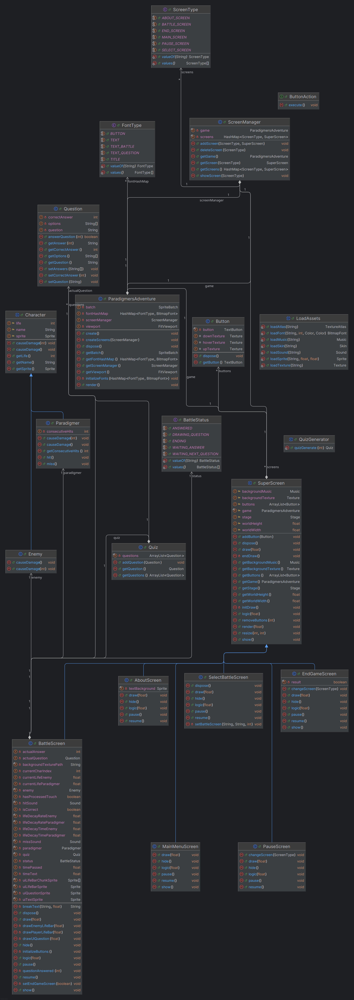

# t2-Paradigmas

## Sumário

- [t2-Paradigmas](#t2-paradigmas)
  - [Sumário](#sumário)
  - [Autor](#autor)
  - [Título](#título)
  - [Descrição](#descrição)
  - [Comentários sobre o desenvolvimento](#comentários-sobre-o-desenvolvimento)
  - [Diagrama de classes](#diagrama-de-classes)
  - [Referências](#referências)
    - [Assets](#assets)
    - [Código](#código)

## Autor

- **Ivan Mendes**

## Título

- **Paradigmer's adventure**

## Descrição

O jogo consiste em uma batalha no estilo pokemon, em que o jogador escolhe um "ataque" (resposta para uma pergunta) e caso acerte, o inimigo leva dano, caso contrário, o jogador leva dano. Foram usados assets de outros jogos para representar o jogo.
O jogo é ambientado em três pontos turísticos da região: **Geoparque Quarta colônia, Geoparque Caçapava do Sul e Jardim Botânico UFSM**.

## Comentários sobre o desenvolvimento

Demorei um pouco para entender como posicionar os elementos da tela, mas após compreender como fazer, o projeto correu tranquilamente. Minhas únicas dificuldades seguintes foi portar o jogo para web, pois estava usando dependencias incompativeis com o GWT para personalizar a fonte (gdx freetype) e para trabalhar com json (gson).
Inicialmente o projeto foi inspirado em um jogo chamado [ColoniaRPG](https://github.com/elc117/game-2023b-coloniarpg), desenvolvido na mesma disciplina no ano passado. Com o andamento do projeto, o jogo ficou cada vez mais distante do jogo original, mas ainda assim, a ideia de um jogo de batalha com perguntas e respostas foi mantida.
Acredito que consegui seguir o paradigma e evitei ao máximo criar uma "Super classe" que faz tudo. A única classe que acabou ficando com muitos métodos e atributos foi a "BattleScreen", que é a tela de batalha, onde ocorre a maior parte da lógica do jogo.

[Clique aqui para jogar](https://ivnmendes.itch.io/paradigmersadventure)

## Diagrama de classes

## Referências

### Assets

- [Backgrounds de batalha, dinossauro e golem](https://www.coromon.com/press/)
- [Planta monstro](https://pixeljoint.com/pixelart/54553.htm)
- [Musica menus](https://pixabay.com/pt/music/jogos-de-video-8-bit-arcade-138828/)
- [IU de batalha, musica de batalha e musica de vitoria](https://pt.wikipedia.org/wiki/Pok%C3%A9mon_FireRed_e_LeafGreen)
- [Som de acerto](https://www.youtube.com/watch?v=mhgOQmwaic4)
- [Som de erro](https://www.youtube.com/watch?v=FRpq7o1mKXY)
- [Botoes](https://github.com/czyzby/gdx-skins?tab=readme-ov-file)

### Código

- [Como usar skins](https://libgdx.com/wiki/graphics/2d/scene2d/skin#skin-json)
- [Criação de botões](https://stackoverflow.com/questions/21488311/how-to-create-a-button-in-libgdx)
- [Personalizar fonte](https://stackoverflow.com/questions/44744047/load-bitmapfont-android-libgdx)
- [FreeType no GWT](https://github.com/intrigus/gdx-freetype-gwt)
- [Quebrar o texto em multiplas linhas](https://chatgpt.com/share/6750ec40-9a38-8010-9cf3-24a4096514b6)
- [Interface funcional](https://www.geeksforgeeks.org/functional-interfaces-java/)
- Foi utilizado IA para correção de erros, auxilio no posicionamento de elementos na tela e para tirar dúvidas sobre a libGdX
